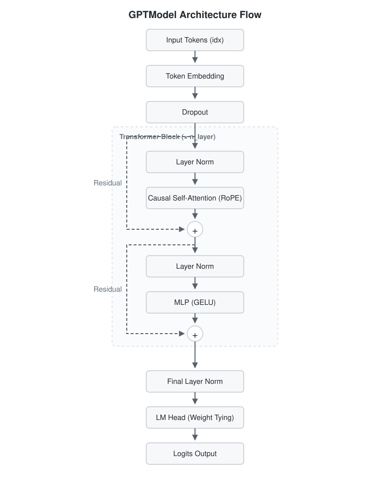

# Model Architecture (モデルアーキテクチャ)

`gpt2/model.py` では、Transformerブロックを基盤とするGPT-2モデルの心臓部を実装している。元論文の枠組みを踏襲しつつ、モダンな改善が組み込まれている。

## 全体構成 (`GPTModel`)

以下にデータが入力されてから出力（Logits）が計算されるまでの、モデル全体のアーキテクチャ図を示す。



### 図とコードの対応（`gpt2/model.py`）
アーキテクチャ図に登場する各ブロックと、実際の `model.py` プログラム内に記述されているクラスや主要変数の対応は以下のようになっている。

| 図のコンポーネント | 対応するクラス・変数 | 役割と動作の概要 |
| :--- | :--- | :--- |
| **Input Tokens** | `GPTModel.forward(idx)` | トークナイズ済みの数値列ベクトル（インデックス）の受け取り。 |
| **Token Embedding** | `self.token_embedding` | `nn.Embedding` オブジェクト。トークンIDから意味を持つ `n_embd` 次元のベクトルに変換する。 |
| **Dropout** | `self.dropout` | `nn.Dropout`。過学習を防ぐため、一定確率でノードを無効化する。 |
| **Transformer Block** | `Block` クラス | 特徴抽出単位。`cfg.n_layer` の数だけ繰り返される (`self.blocks`)。 |
| ↳ **Layer Norm** | `self.ln_1`, `self.ln_2` | `nn.LayerNorm`。AttentionやMLPへ入力する直前にテンソルを正規化する。 |
| ↳ **Causal Self-Attention** | `CausalSelfAttention` | 過去の文脈群から情報を集約する注意機構（`self.attn`）。 |
| ↳ *(RoPE機能)* | `RotaryPositionalEmbedding` | Attentionモジュール内部でクエリとキーにのみ相対的位置情報を回転計算として提供する。 |
| ↳ **MLP (GELU)** | `MLP` クラス | Attentionで抽出した情報を非線形変換(GELU)し、より深い特徴量を作り出す表現層（`self.mlp`）。 |
| **Final Layer Norm** | `self.ln_f` | すべてのブロック処理後に行われる最終的な正規化層。 |
| **LM Head** | `self.lm_head` | 隠れ次元を元の語彙サイズ(`vocab_size`)に戻す全結合層。埋め込み層と重み(`weight`)を共有している。 |
| **Logits Output** | `logits` 変数 | 各トークンの次単語の出現確率スコア（Softmaxを通す前の生の値）となり出力される。 |

モデル全体は以下の要素で構成される:
1. **Token Embedding (`token_embedding`)**: `idx` (入力トークンID列) を対応する埋め込みベクトルに変換する。この実装では、位置情報を明示的に加算するAbsolute Position Embeddingの代わりにRoPE（後述）が使用されているため、ここではトークンそのものの意味表現のみを扱う。
2. **Transformer Blocks (`blocks`)**: セルフアテンション機構と順伝播ニューラルネットワーク（MLP）を組み合わせた `Block` クラスのリストである。
3. **LayerNorm と LM Head (`ln_f`, `lm_head`)**: すべてのブロックを経た層の正規化の後、語彙サイズへの射影を行う全結合層である。
4. **重みの共有設定 (`self.lm_head.weight = self.token_embedding.weight`)**: 出力層の重みと入力トークンの埋め込み重みを共有化（Weight Tying）することで、パラメータ数の圧縮と表現力の統一を図っている。

## Rotary Position Embedding (RoPE)

最近の言語モデルでデファクトスタンダードとなっている位置エンコーディング手法である。絶対的な位置番号を加算するのではなく、**クエリ(Q)とキー(K)に回転行列をかけることで「相対的な位置」を表現**する。

### 実装のポイント
- クラス `RotaryPositionalEmbedding` によって、サイン($\sin$)とコサイン($\cos$)のテーブルを事前に計算し、キャッシュしている。

```python
class RotaryPositionalEmbedding(nn.Module):
    def __init__(self, head_dim: int, max_seq_len: int):
        super().__init__()
        # θ_i = 1 / 10000^(2i / head_dim)
        theta = 1.0 / (10000 ** (torch.arange(0, head_dim, 2).float() / head_dim))
        positions = torch.arange(max_seq_len).float()
        freqs = torch.outer(positions, theta)
        
        # freqs情報を元に、cosとsinのテーブルを作成して登録
        cos = torch.cat([freqs.cos(), freqs.cos()], dim=-1)
        sin = torch.cat([freqs.sin(), freqs.sin()], dim=-1)
        self.register_buffer("cos_cache", cos)
        self.register_buffer("sin_cache", sin)
```

- アテンション計算の直前で、補助関数である `_rotate_half` や `apply_rotary_emb` を介し、$Q$ と $K$ それぞれのベクトルにのみ直接回転演算を適用する。値（$V$）自体は回転しない。この回転演算はテンソルの後半部分と前半部分の符号スワップを利用することで効率的に処理される。

## Causal Self-Attention

自己注意機構（Self-Attention）に「未来の単語を参照できない」制約を取り入れた（因果的/Causal）モジュールである。

### アテンションスコアの計算とマスク
- `einsum("bhid,bhjd->bhij", q, k)` により、$Q$ と $K$ の内積を取り、素の（Raw）アテンションスコアを算出する。
- `causal_mask` として用意された下三角行列のブーリアンフラグ（`torch.tril`）を反転（`~`）させ、未来を参照している箇所に「負の無限大 (`float("-inf")`)」を代入する (`.masked_fill()`) マスキングを行う。
- その後 `F.softmax` を適用することで、未来の箇所へのAttention重みが厳密に `0` となるように機能する。

```python
        # アテンション重み(スコア)の算出
        att = torch.einsum("bhid,bhjd->bhij", q, k)
        att = att * (self.head_dim**-0.5)
        
        # 未来の情報を見ないためのマスキング処理
        mask = self.causal_mask[:, :, :seqlen, :seqlen]
        att = att.masked_fill(~mask, float("-inf"))
        
        # softmaxで確率値へ変換 (マイナス無限大は0になる)
        att = F.softmax(att, dim=-1)
        att = F.dropout(att, p=self.dropout, training=self.training)
        
        # 値(V)に重みを乗算して出力を生成
        y = torch.einsum("bhij,bhjd->bhid", att, v)
```

## MLP (順伝播層)

MLPブロックでは、隠れ層の次元を一度4倍（`4 * cfg.n_embd`）に拡張し、活性化関数を経て元の次元に戻す処理を行う。
活性化関数には、ReLUの派生であり自然言語処理で一般的に使われる `GELU` (Gaussian Error Linear Unit) を使用し、なめらかな非線形性を与えている。計算効率を確保するために近似モード（`approximate="tanh"`）が利用されている。

## PyTorch Lightningによる抽象化 (`GPTLightning`)

`GPTLightning` は、PyTorch Lightningの `LightningModule` を継承したラッパークラスである。
純粋なPyTorchモデル（`GPTModel`）を内部に保持し、学習プロセスに必要な以下の責務を担う:
- `training_step` / `validation_step` の定義（教師データの損失計算とロギング）。
- Optimizerおよび学習率スケジューラ（`configure_optimizers`）の設定。ここでは独自に定義した `build_optimizer` や `lr_for_step` （ウォームアップ処理）が利用される。
- 重み減衰（Weight Decay）が必要なパラメータ（2次元以上）と、そうでないパラメータ（バイアスや1D正規化の重みなど）のグループ分けを行うことで、学習の安定性を維持する。
